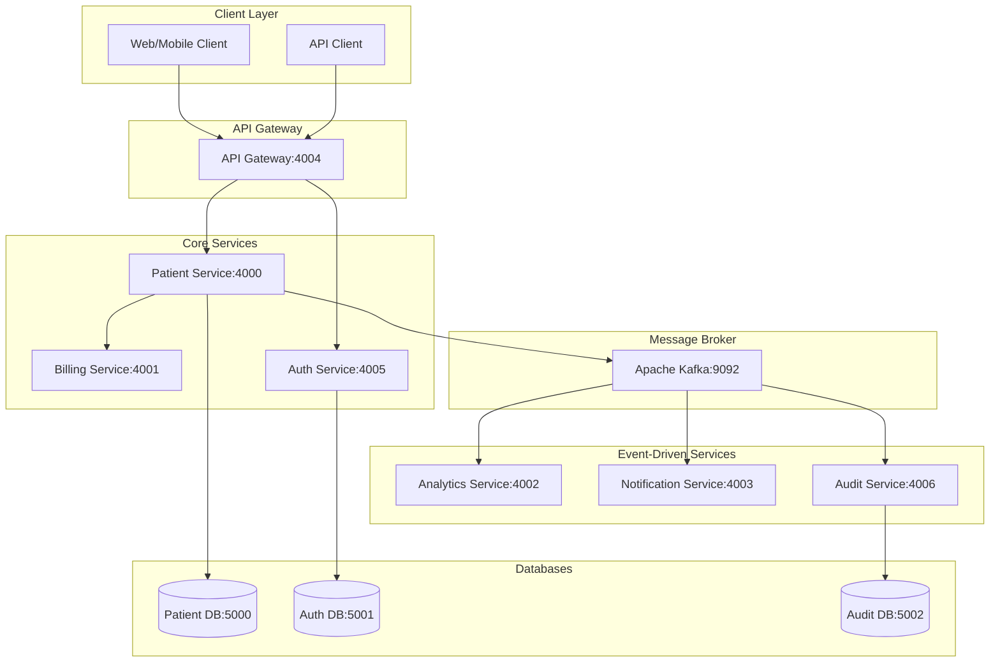

# Patient Management System - Microservices Architecture

## Overview

This project is a hands-on exploration of microservices architecture, designed to learn about distributed systems, service communication patterns, and fault tolerance. It implements a patient management system using Java Spring Boot with 7 independently deployable services communicating via REST APIs, gRPC, and Apache Kafka.

The system simulates a real-world healthcare scenario where patient records trigger various downstream processes: billing account creation, analytics processing, audit logging, and notification sending.

## Learning Objectives

- **Microservices Design**: Understand service boundaries, data ownership, and inter-service communication
- **Communication Patterns**: Implement synchronous (REST, gRPC) and asynchronous (Kafka) communication
- **Fault Tolerance**: Build resilience with retry mechanisms, dead letter queues, and error handling
- **Event-Driven Architecture**: Design systems around events rather than direct service calls
- **Containerization**: Package services as Docker containers with Docker Compose orchestration
- **Database Per Service**: Apply the microservices principle of dedicated databases per service

## Architecture Overview



## Services Overview

| Service | Port | Technology | Purpose |
|---------|------|------------|---------|
| **patient-service** | 4000 | Spring Boot, JPA, PostgreSQL | Core patient CRUD operations, publishes events to Kafka |
| **billing-service** | 4001, 9001 | Spring Boot, gRPC | Creates billing accounts via synchronous gRPC calls |
| **analytics-service** | 4002 | Spring Boot, Kafka Consumer | Processes patient events for analytics (logs events) |
| **notification-service** | 4003 | Spring Boot, Kafka Consumer | Sends welcome notifications to new patients |
| **auth-service** | 4005 | Spring Boot, JPA, PostgreSQL | Handles authentication and JWT token generation |
| **api-gateway** | 4004 | Spring Boot Gateway | Routes requests to appropriate services |
| **audit-service** | 4006 | Spring Boot, JPA, PostgreSQL, Kafka Consumer | Logs all patient events for compliance and audit trails |

## Communication Patterns

### 1. **Synchronous REST (HTTP)**
- **patient-service** exposes REST endpoints for patient CRUD operations
- **auth-service** provides JWT-based authentication
- **api-gateway** routes HTTP requests to appropriate services

### 2. **Synchronous gRPC**
- **patient-service** → **billing-service**: When a patient is created, a gRPC call creates a billing account
- Uses Protocol Buffers for contract definition (`billing_service.proto`)
- Blocking stub for immediate response

### 3. **Asynchronous Event-Driven (Kafka)**
- **patient-service** publishes `PatientEvent` messages to Kafka `patient` topic
- **analytics-service**, **notification-service**, **audit-service** consume events independently
- Protocol Buffers serialization for efficient binary communication

## Database Design

Each service owns its database following the **Database per Service** pattern:

| Service | Database | Purpose |
|---------|----------|---------|
| patient-service | PostgreSQL (port 5000) | Patient records with UUID primary keys |
| auth-service | PostgreSQL (port 5001) | User credentials and authentication data |
| audit-service | PostgreSQL (port 5002) | Immutable audit log of all patient events |

## Kafka & Message Queues

### Topics
- `patient`: Main topic for patient events (creation, updates)
- `patient.DLQ`: Dead letter queue for producer failures
- `patient-dlt`: Dead letter topic for consumer failures (managed by Spring Kafka RetryTopic)
- `patient-0`, `patient-1`, `patient-2`: Retry topics for failed consumer processing

### Event Schema (Protocol Buffers)
```protobuf
message PatientEvent {
  string patientId = 1;
  string name = 2;
  string email = 3;
  string event_type = 4;
}
```

## Failure Handling & Resilience

### Producer-Side (patient-service)
- **Retries**: 3 automatic retries with idempotence enabled
- **Dead Letter Queue**: Failed messages after retries go to `patient.DLQ`
- **Error Handling**: Asynchronous callbacks with logging

### Consumer-Side (analytics, notification, audit services)
- **RetryTopic Pattern**: 4 attempts with exponential backoff (1s → 2s → 4s)
- **Dead Letter Topics**: Failed messages go to `patient-dlt` after retries
- **DLT Handlers**: Separate consumers log failed messages for manual inspection

### Consistency Guarantees
The system implements **at-least-once delivery** with idempotent consumers:
1. Patient created and saved to database (transactional)
2. gRPC call to billing-service (synchronous, blocking)
3. Kafka event published (asynchronous, fire-and-forget with DLQ)

## Running the Project

### Prerequisites
- Docker and Docker Compose
- Java 17+ (for local development)
- Maven (for local building)

### Quick Start
```bash
# Clone the repository
git clone <repository-url>
cd PatientManagement

# Start all services
docker-compose up --build

# Or run in background
docker-compose up -d --build
```

### Service URLs
- **Patient Service API**: http://localhost:4000/patients
- **API Gateway**: http://localhost:4004
- **Kafka UI**: Use `kcat` or `kafka-console-consumer` on localhost:9092

### Testing the System
1. Create a patient via POST to `http://localhost:4000/patients`
2. Observe logs in different services:
   - billing-service: gRPC call processed
   - analytics-service: Event logged
   - notification-service: Welcome notification sent
   - audit-service: Audit record saved

## Infrastructure as Code (AWS CDK)

The project includes AWS CDK code for deploying to AWS or LocalStack (local AWS simulation):

```bash
cd infrastructure
mvn compile
cdk synth
```

### Key Infrastructure Components
- **VPC with public/private subnets**
- **Amazon MSK (Managed Kafka) cluster**
- **Amazon RDS PostgreSQL instances** (one per service that needs a database)
- **Amazon ECS Fargate services** for each microservice
- **Application Load Balancer** for API Gateway
- **Route53 health checks** for database monitoring

### LocalStack Development
Use the included `localstack-deploy.sh` script to deploy to a local LocalStack instance:

```bash
./infrastructure/localstack-deploy.sh
```

## Cloud Deployment Options

Two deployment strategies are analyzed in `cloud-deployment.md`:

### Option 1: Google Cloud Run (Serverless)
- **Pros**: Managed infrastructure, automatic scaling, high availability
- **Cons**: Cost exceeds free tier for always-on services, complex billing
- **Best for**: Production deployments where reliability is critical

### Option 2: Oracle Cloud ARM Compute (Free Tier)
- **Pros**: Completely free, excellent learning experience, full control
- **Cons**: Single point of failure, manual setup, security responsibility
- **Best for**: Learning projects, hobby projects with zero budget

### Recommendation
- **Learning/Zero-budget**: Oracle Cloud ARM Compute
- **Production**: Google Cloud Run or AWS ECS Fargate

## Development Scripts

The `scripts/` directory contains automation scripts:

- `dockerize.sh`: Builds all Docker images
- `infrastructure/localstack-deploy.sh`: Deploys to LocalStack

Use these scripts to automate common development tasks.

## Key Features Implemented

### 1. **Service Discovery & Communication**
- Docker Compose networking with service names as DNS
- Environment-based configuration for service addresses

### 2. **Data Consistency**
- Local database transactions per service
- Eventual consistency through Kafka events
- Compensation actions for failures (DLQ monitoring)

### 3. **Security**
- JWT-based authentication (auth-service)
- Separate database credentials per service
- Environment variables for sensitive data

### 4. **Observability**
- Structured logging across all services
- Kafka consumer group monitoring
- Database connection pooling

## Development Setup

### Building Locally
```bash
# Build all services
./scripts/dockerize.sh

# Or build individually
cd patient-service && mvn clean package
```

### Testing

#### Integration Tests
The `integration-tests` module contains end-to-end tests that verify the entire system works together:

- **PatientIntegrationTest**: Tests patient retrieval with JWT authentication
- **AuthIntegrationTest**: Tests authentication flow

**Prerequisites**: All services must be running (use `docker-compose up`)

```bash
cd integration-tests && mvn test
```

#### Unit Tests
Each service contains basic unit tests (minimal coverage for demonstration):

```bash
# Run tests for a specific service
cd patient-service && mvn test
```

#### Test Strategy
- **Contract Tests**: gRPC interfaces defined with Protocol Buffers
- **Integration Tests**: End-to-end flows using REST Assured
- **Unit Tests**: Basic service layer testing (to be expanded)
### Code Generation
```bash
# Generate gRPC/protobuf code
mvn compile
```
