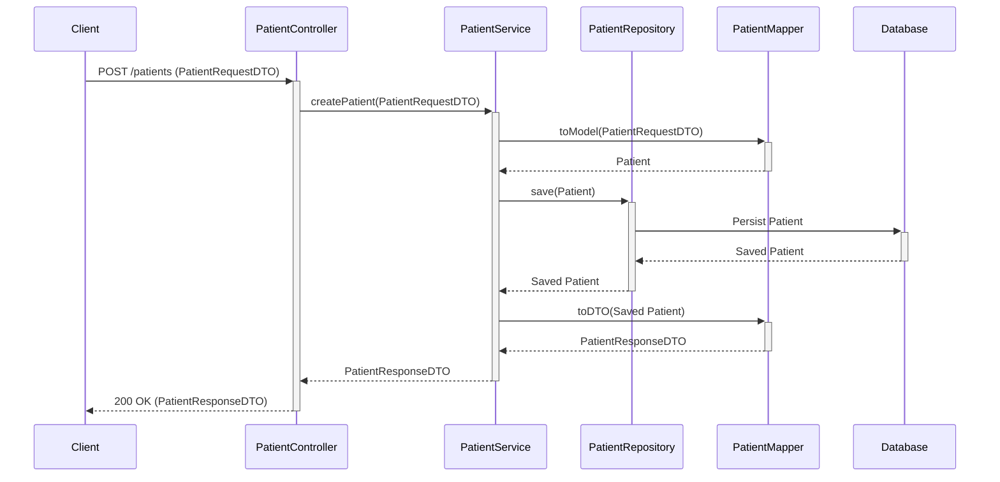
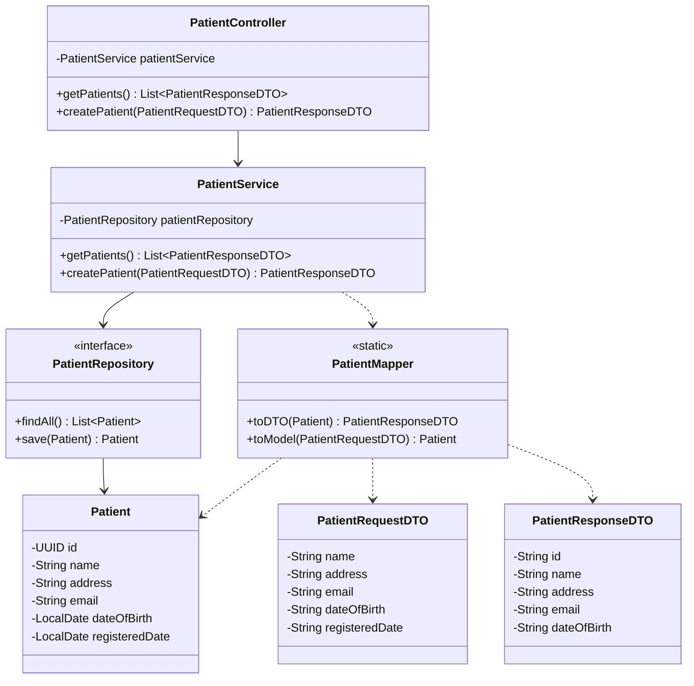

# Program Design: Patient Management Service

This document outlines the flow and structure of the Patient Management Service.

## Create Patient Sequence Diagram

The following diagram illustrates the sequence of events when a new patient is created.

## Class Diagram

This diagram shows the relationships between the major classes in the service.

