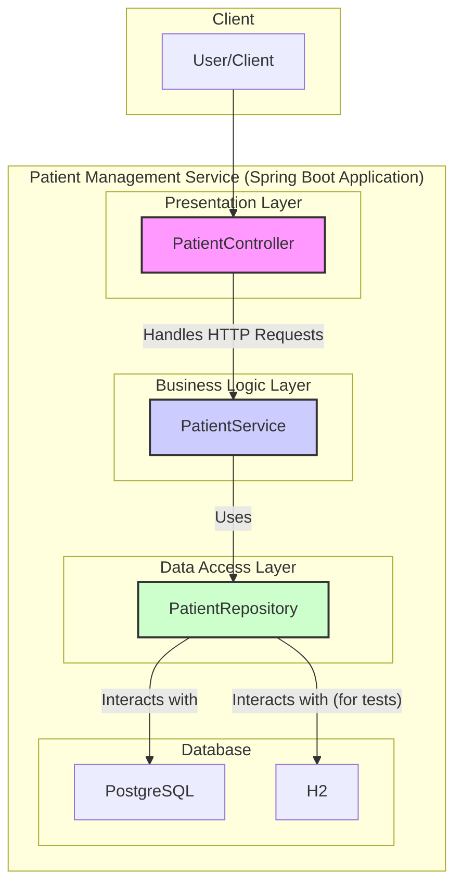

# System Architecture: Patient Management Service

This document provides a high-level overview of the Patient Management Service's architecture, based on its key dependencies and components.

## Architectural Diagram

The application follows a classic 3-tier architecture:

1.  **Presentation Layer**: Handles HTTP requests and validation.
2.  **Business Logic Layer**: Contains the core application logic.
3.  **Data Access Layer**: Manages data persistence.

### Key Dependencies

-   **Spring Boot Starter Web**: Provides the web layer, including a RESTful API and an embedded Tomcat server.
-   **Spring Boot Starter Data JPA**: Simplifies data access with JPA (Java Persistence API).
-   **PostgreSQL Driver**: Enables communication with a PostgreSQL database.
-   **H2 Database**: An in-memory database, primarily used for testing.
-   **Spring Boot Starter Validation**: Provides data validation capabilities.
